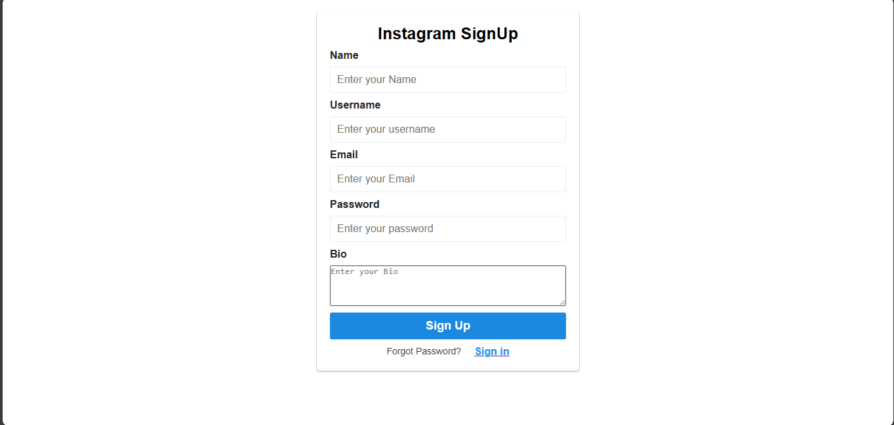
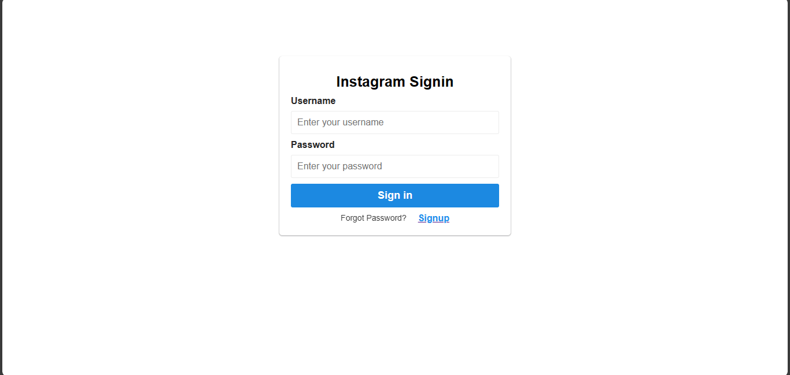

# Instagram Login and Signup Authentication

This project implements user authentication for an Instagram-like application using the MERN stack (MongoDB, Express.js, React, Node.js). The authentication process involves secure password hashing, JWT (JSON Web Token) generation, CORS handling, and other features.






## Modules Utilized

- Mongoose: MongoDB object modeling
- Cors: Cross-origin resource sharing
- Cookie-parser: Parsing cookies
- Dotenv: Managing environment variables
- Email-validator: Validating email addresses
- Bcrypt: Hashing passwords
- JWT: JSON Web Token authentication
- Nodemon: Auto-restart server during development

## Technologies Used

- React
- Node.js
- Express
- MongoDB

## API Endpoints

- `/signup`: Create a new user account by providing the required information (name, username, email, password, and bio).
- `/signupDataValidate`: Middleware to validate the sign-up data before saving it to the database.
- `/login`: Authenticate a user by providing the username and password.
- `/loginDataValidate`: Middleware to validate the login data before processing the authentication.
- `/logout`: Logout the currently authenticated user.
- `/checkAuth`: Middleware to check if a user is authorized or not.

## Key Features

- User Signup: Allow users to create an account with their name, username, email, password, and bio.
- User Login: Authenticate users using their credentials. Upon successful login, redirect to the home page.
- User Logout: Allow users to log out of their account.
- Protected Home Page: Display user details on the home page. Access to the home page is protected, requiring authentication.

## Getting Started

To run this project locally, follow these steps:

1. Clone the repository: `git clone <repository-url>`
2. Navigate to the project directory: `cd instagram-authentication`
3. Install the dependencies: `npm install`
4. Set up the environment variables:
   - Create a `.env` file in the backend directory.
   - Define the following variables in the `.env` file:
     ```
     PORT=<server-port>
     MONGODB_URI=<mongodb-connection-string>
     CLIENT_URL=<client-side-url>
     SECRET=<jwt-secret-key>
     ```
5. Start the server: `npm start`
6. Open the client-side folder and install the dependencies: `cd client` and `npm install`
7. Start the client-side development server: `npm start`
8. Open a web browser and access the application at `http://localhost:<server-port>`

Feel free to customize and enhance the project according to your needs and send pull requests.